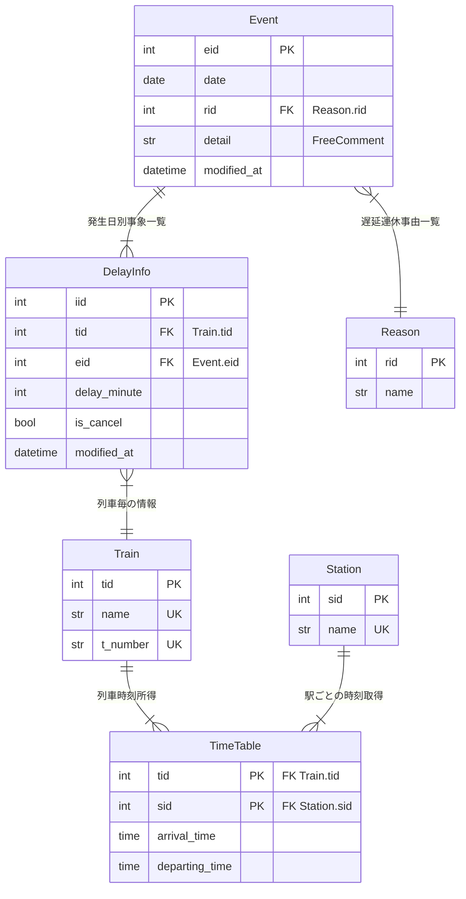

### Delay_Info ER図

```mermaid
erDiagram
    Train ||--|{ TimeTable : "列車時刻所得"
    DelayInfo }|--|| Train : "列車毎の情報"
    Station ||--|{ TimeTable : "駅ごとの時刻取得"
    Event ||--|{ DelayInfo : "発生日別事象一覧"
    Event }|--|| Reason : "遅延運休事由一覧"

Reason {
    int rid PK
    str name
}

Event {
    int eid PK
    date date
    int rid FK "Reason.rid"
    str detail "FreeComment"
    datetime modified_at

}

Train {
    int tid PK
    str name UK
    str t_number UK
}

DelayInfo {
    int iid PK
    int tid FK "Train.tid"
    int eid FK "Event.eid"
    int delay_minute
    bool is_cancel
    datetime modified_at
}

Station {
    int sid PK
    str name UK
}

TimeTable {
    int tid PK "FK Train.tid"
    int sid PK "FK Station.sid"
    time arrival_time
    time departing_time
}
```
